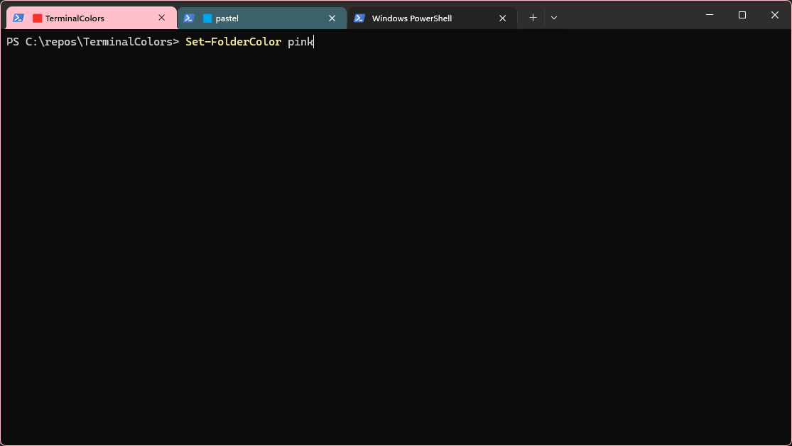

# TerminalColors

[](https://www.powershellgallery.com/packages/TerminalColors)
[](https://www.powershellgallery.com/packages/TerminalColors)
[](https://github.com/ceddup/TerminalColors/actions/workflows/ci.yml)
[](LICENSE)

**Windows Terminal change de couleur quand vous entrez dans un projet.**

*[English version](README.md)*



Vous utilisez déjà [Peacock](https://marketplace.visualstudio.com/items?itemName=johnpapa.vscode-peacock)
dans VS Code et [Solution Colors](https://marketplace.visualstudio.com/items?itemName=MadsKristensen.SolutionColors)
dans Visual Studio pour reconnaître un projet d'un coup d'œil. TerminalColors apporte
la même chose à Windows Terminal — **et réutilise les couleurs que vous avez déjà définies**.

```
PS C:\> cd C:\Repos\oseille          -> onglet vert, bordure verte
PS C:\Repos\oseille> cd ..\pastel    -> onglet et bordure passent en cyan
PS C:\Repos\pastel> cd C:\           -> retour à la normale
```

Aucun outil tiers, aucun AutoHotkey, aucun service en tâche de fond : un module
PowerShell, et c'est tout.

---

## Installation

Prérequis : Windows 11, Windows Terminal, PowerShell 5.1 ou 7 (les deux sont pris en
charge). Aucun droit administrateur, rien d'installé hors de votre profil utilisateur.

### Taper dans PowerShell :

```powershell
Install-Module TerminalColors -Scope CurrentUser
Install-TerminalColors
```

`Install-Module` ne peut pas faire le travail de la seconde ligne : la coloration exige de
modifier les réglages de Windows Terminal et votre profil PowerShell, ce qu'aucun
gestionnaire de paquets n'a le droit de faire à votre place. `Install-TerminalColors`
enchaîne les trois étapes — thème, calque opaque, bloc de profil — rend compte de chacune,
et active la coloration dans la session courante. Commutateurs utiles :
`-SystemTitleBar`, `-SkipBackdrop`, `-Force`, `-WhatIf`, `-Quiet`, `-PassThru`.

`Uninstall-TerminalColors` défait l'ensemble.

### Depuis un clone

```powershell
git clone https://github.com/ceddup/TerminalColors.git
cd TerminalColors
.\install.ps1
```

`install.ps1` copie le module puis appelle `Install-TerminalColors` pour le reste : les deux
chemins d'installation font donc exactement la même chose, avec les mêmes commutateurs.

Puis **ouvrez un nouvel onglet** et faites `cd` dans un de vos dépôts.

### Vérifier l'installation

```powershell
Invoke-TerminalColorsDoctor
```

Cette commande signale précisément ce qui bloquerait la coloration : thème absent,
`tabColor` figé sur le profil, `suppressApplicationTitle` actif, `-PureColor` sans calque
opaque, Windows trop ancien...

---

## D'où vient la couleur

À chaque changement de dossier, TerminalColors remonte l'arborescence. **Le dossier
le plus proche qui définit une couleur gagne** (même logique que `.editorconfig`).
Dans un dossier donné, l'ordre de priorité est :

| Priorité | Source | Fichier lu |
| --- | --- | --- |
| 1 | Configuration TerminalColors | `.terminalcolors.json` |
| 2 | **Peacock** (VS Code) | `.vscode/settings.json` → `peacock.color` |
| 3 | **Solution Colors** (Visual Studio) | `.vs/<Solution>/color.txt` |
| 4 | Dépôt Git | présence de `.git` → couleur stable dérivée du nom |

Concrètement, si vos projets sont déjà colorés dans VS Code ou Visual Studio, il n'y a
**rien à configurer** : les mêmes couleurs apparaissent dans le terminal. Les autres
dépôts Git reçoivent une couleur automatique, stable et identique sur tous les postes
(dérivée du nom du dépôt par un hachage FNV-1a, pas du hasard).

Pour voir la carte de vos dépôts :

```powershell
Get-ChildItem C:\Repos -Directory | Get-TerminalColor | Format-Table Name, Color, Icon, Source
```

```
Name             Color   Icon Source
----             -----   ---- ------
oseille          #215732 🟩   Peacock
pastel           #61DAFB 🟦   Peacock
superviseur_c2   #008080 🟩   SolutionColors
ioda_v3          #1818D8 🟦   GitRepository
```

`Get-TerminalColor` indique aussi le fichier exact retenu (`SourcePath`) : pratique
quand une couleur surprend.

---

## Choisir une couleur explicitement

```powershell
Set-FolderColor '#215732'                 # dossier courant
Set-FolderColor Teal -Path C:\Repos\sgi   # nom de couleur connu
Set-FolderColor auto                      # couleur stable dérivée du nom du projet
```

Cela écrit un `.terminalcolors.json` volontairement lisible et versionnable —
**commitez-le et toute l'équipe partage la couleur du projet** :

```json
{
  "color": "#215732",
  "name": "Oseille"
}
```

Toutes les options du fichier :

```json
{
  "color": "#215732",
  "name": "Oseille",
  "icon": "🟩",
  "tint": 0.45,
  "applyToSubfolders": true,
  "branches": {
    "main": "#215732",
    "release/*": "#B71C1C",
    "hotfix/*": "OrangeRed"
  }
}
```

| Clé | Rôle |
| --- | --- |
| `color` | code hexadécimal, nom de couleur connu, ou `auto` |
| `name` | libellé de l'onglet (défaut : nom du dossier) |
| `icon` | symbole devant le libellé (défaut : carré coloré déduit de la couleur) |
| `tint` | intensité de la teinte du fond pour ce projet, de 0 à 1 (ignorée avec `-PureColor`) |
| `applyToSubfolders` | `false` pour limiter la couleur au seul dossier |
| `branches` | couleur par branche Git, jokers acceptés, première correspondance retenue |

Un schéma JSON est fourni dans [`schema/terminalcolors.schema.json`](schema/terminalcolors.schema.json)
pour l'autocomplétion dans VS Code.

Les couleurs par branche sont pratiques pour se rendre compte immédiatement qu'on est
sur `release/*` ou `hotfix/*` avant de lancer une commande.

---

## Réglages

Le comportement se règle sur la ligne `Enable-TerminalColors` de votre profil
(`$PROFILE.CurrentUserAllHosts`, modifiable à la main) :

```powershell
Enable-TerminalColors -PureColor -TitleFormat '{icon} {name} ({folder})'
```

| Paramètre | Effet |
| --- | --- |
| `-PureColor` | envoie la couleur sans dilution. Exige le calque opaque |
| `-Tint <0..1>` | intensité de la teinte du fond hors `-PureColor` (défaut `0.30`) |
| `-TitleFormat` | gabarit du titre. Jetons : `{icon}` `{name}` `{color}` `{folder}` `{path}` |
| `-NoTitle` | ne touche pas au titre de l'onglet |
| `-NoIcons` | pas de carré coloré devant le libellé |
| `-NoWindowBorder` | n'appelle pas `DwmSetWindowAttribute` (la bordure vient du thème) |
| `-CaptionColor` | colore aussi la barre de titre système (exige `Install-TerminalColorsTitleBar`) |
| `-NoAutoGitColors` | n'utilise que les couleurs déclarées explicitement |
| `-BaseBackground` | force la couleur de fond de référence servant au mélange |
| `-ExplicitReset` | en sortie de projet, réécrit la couleur de fond au lieu d'émettre `OSC 111` |
| `-AlwaysReapply` | réémet la couleur à chaque invite, et non seulement au changement de dossier — utile si un programme réinitialise le fond du terminal |

Autres commandes : `Disable-TerminalColors`, `Reset-TerminalColor`,
`Update-TerminalColor -Force`, `Clear-TerminalColorCache`, `Remove-FolderColor`, et le
trio `Install-`/`Uninstall-`/`Test-` pour `TerminalColorsTheme`,
`TerminalColorsBackdrop`, `TerminalColorsTitleBar` et `TerminalColorsProfile`.

Toutes disposent d'une aide complète : `Get-Help Enable-TerminalColors -Full`.

---

## Comment ça marche

Windows Terminal n'expose aucune API pour recolorer un onglet à la demande. TerminalColors
combine donc trois mécanismes, tous natifs.

**1. `OSC 11`** — la séquence de contrôle standard qui demande au terminal de changer sa
couleur de fond. Le module l'émet à chaque changement de dossier.

**2. Le thème Windows Terminal** installé déclare
`"tab": { "background": "terminalBackground", "unfocusedBackground": "terminalBackground" }`
et `"window": { "frame": "terminalBackground", "unfocusedFrame": "terminalBackground" }`.
Windows Terminal recopie alors la couleur de fond de chaque volet sur son onglet et sur la
bordure de la fenêtre. C'est ce qui rend la coloration visible là où ça compte, sans
processus supplémentaire — et c'est pour cela que le thème est indispensable.

La bande d'onglets en est volontairement exclue, et laissée intacte : le thème ne déclare
rien pour elle, donc Windows Terminal continue de la peindre comme avant. Voir plus bas :
qu'elle ne suive pas le projet est aussi ce qui permet aux onglets d'arrière-plan de garder
leur couleur.

**3. Le calque opaque** résout le problème que ces deux mécanismes créent ensemble. Un
thème n'accepte que quatre valeurs pour `tab.background` : `terminalBackground`, `accent`,
une couleur figée, ou rien. La seule pilotable à l'exécution est `terminalBackground` —
autrement dit, *couleur de l'onglet* et *couleur de fond* sont un seul et même canal.
Y envoyer une couleur franche rendrait le volet illisible : sans calque, la couleur doit
donc être diluée — 30 % par défaut.

Le calque découple les deux : `OSC 11` envoie la couleur **pure** du projet, et une image
de fond opaque de votre couleur de fond habituelle est posée par-dessus dans le volet.
Windows Terminal peint l'onglet à partir de la *couleur* de fond, jamais de l'*image* :
l'onglet devient franc, le volet reste tel quel. Les images sont de minuscules PNG
générés par le module dans `%LOCALAPPDATA%\TerminalColors`.

**4. `DwmSetWindowAttribute`** — utilisée seulement pour la barre de titre système
(`DWMWA_CAPTION_COLOR`), qui n'existe que si les onglets sortent de la barre de titre. Ce
n'est **pas** elle qui colore la bordure de fenêtre : `DWMWA_BORDER_COLOR` renvoie `S_OK`
sur une fenêtre Windows Terminal et ne change rien, parce que Windows Terminal dessine son
propre cadre. C'est le thème qui fait ce travail (mécanisme 2). Le module localise la fenêtre
en remontant la chaîne des processus parents, et l'interop est compilée à la première
utilisation seulement, pour ne pas ralentir le démarrage de vos sessions.

Tout ce qui concerne la fenêtre entière lui appartient, pas à l'onglet : seul l'onglet visible
a le droit de le piloter. Un onglet compare le titre de la fenêtre aux titres qu'il a posés, et
n'y touche pas quand ce n'est pas lui qui est à l'écran. Il refuse aussi de *réinitialiser* une
couleur qu'il n'a jamais posée : quand plusieurs onglets démarrent en même temps, un onglet
sans couleur restaure le titre par défaut du shell — exactement ce que la fenêtre affiche tant
que l'onglet actif n'a pas posé le sien — donc le titre seul ne suffit pas à les distinguer.

### Pourquoi la bande d'onglets est laissée tranquille et les onglets non

Mesuré, pas supposé : l'onglet **sélectionné** est peint avec sa propre couleur de fond, de
façon opaque, alors qu'un onglet **d'arrière-plan** est composité à environ 30 % d'opacité
par-dessus la bande d'onglets.

La bande est donc la base dans laquelle tout onglet d'arrière-plan se mélange. Quand elle
portait la couleur du projet actif, ces onglets en empruntaient 70 % : un onglet noir à côté
d'un projet `#215732` mesurait `#1A4026`, un `#61DAFB` mesurait `#347E6E` — tout devenait
vert. Ce qui règle le problème, c'est seulement que la bande ne suive pas le projet :
**n'importe quelle** couleur stable convient.

Le thème ne déclare donc rien du tout pour elle, exactement comme les thèmes intégrés de
Windows Terminal — `light`, `dark` et `system` ne posent pas non plus de `tabRow.background`.
La bande garde la couleur que Windows Terminal lui donne, et installer ce module n'y change
rien. `-TabRowColor` l'épingle si vous voulez vraiment une couleur précise.

Ce que le thème reprend, en revanche, c'est `window.applicationTheme`, l'identité claire ou
sombre du chrome, héritée du thème qu'il remplace. Sélectionner un thème remplace le
précédent en entier : sans cela, la bande basculerait sur un Windows réglé dans l'autre mode.

La conséquence à connaître : un onglet d'arrière-plan affiche une version **atténuée** de sa
couleur, pas la couleur pleine. `#61DAFB` sur une bande sombre à `#0C0C0C` ressort à
`#254953`. Windows Terminal n'offre aucune valeur par onglet peinte de façon opaque : il n'y a
pas de contournement.

Le hook d'invite enveloppe votre fonction `prompt` existante (oh-my-posh, Starship ou la
vôtre), qui reste intacte et est restaurée par `Disable-TerminalColors`. Il ne fait rien
du tout tant que le dossier n'a pas changé, et la résolution est mise en cache avec
invalidation sur la date de modification du fichier source : le coût par invite est
négligeable.

### Barre de titre système

Par défaut, Windows Terminal dessine ses onglets *dans* la barre de titre : la fenêtre
n'a donc pas de vraie barre de titre système. `Install-TerminalColorsTitleBar` écrit
`showTabsInTitlebar: false`, ce qui rend à la fenêtre une véritable barre de titre
système, que DWM colore directement — couleur pure, immédiate, sans passer par la couleur
de fond.

Contrepartie : la bande d'onglets descend sous la barre de titre. Exige un redémarrage
complet de Windows Terminal, et `Enable-TerminalColors -CaptionColor` pour appliquer
effectivement la couleur.

### Est-ce que ça tient dans le temps ?

Ce qui est acquis une fois pour toutes : le module est dans vos modules personnels, le
bloc est dans votre profil, le thème et le calque sont dans `settings.json`. La coloration
revient donc à chaque nouvel onglet, après chaque redémarrage, et les mises à jour de
Windows Terminal ne touchent pas à ces réglages. Aucun service, aucune tâche planifiée,
aucun processus résident : rien qui puisse « s'arrêter ».

Les trois seules choses qui peuvent la désactiver, toutes réversibles :

1. **Choisir un autre thème** dans les réglages de Windows Terminal (Apparence → Thème).
   Correctif : `Install-TerminalColorsTheme`.
2. **Clic droit sur un onglet → Couleur…**, ou un `tabColor` dans un profil : cette
   couleur manuelle est prioritaire sur le thème et fige l'onglet.
   Correctif : la retirer.
3. **Une autre invite personnalisée installée après coup** (oh-my-posh, Starship) qui
   redéfinit `prompt` en écrasant le hook. Correctif : placer l'appel
   `Enable-TerminalColors` **après** son initialisation dans votre profil.

Dans les trois cas, `Invoke-TerminalColorsDoctor` nomme le problème et le correctif.

### Limites connues

- **Un onglet en arrière-plan affiche une version atténuée de sa couleur**, pas la couleur
  pleine — Windows Terminal le composite à environ 30 % d'opacité par-dessus la bande
  d'onglets, et n'offre aucune valeur par onglet peinte de façon opaque. `#61DAFB` sur une
  bande sombre à `#0C0C0C` ressort à `#254953`. L'onglet sélectionné et la bordure de
  fenêtre portent la couleur exacte du projet.
- **La bordure de fenêtre fait un pixel de large.** Cette épaisseur vient de Windows, et ni
  le thème ni `DwmSetWindowAttribute` n'expose de largeur. Pour une grande surface colorée,
  `Install-TerminalColorsTitleBar` donne une vraie barre de titre système.
- **La bordure exige un Windows Terminal assez récent pour gérer `window.frame`** dans les
  thèmes (1.19+). Sur les versions antérieures l'onglet fonctionne quand même, et le module
  retombe sur `DwmSetWindowAttribute` — sans effet sur Windows Terminal, mais sans risque.
- Un `tabColor` défini sur un profil Windows Terminal **prend le pas sur le thème** et
  figera la couleur de l'onglet. `Invoke-TerminalColorsDoctor` le signale.
- Le calque opaque remplace `profiles.defaults.backgroundImage`. Si vous utilisez déjà une
  image de fond, restez sur `-SkipBackdrop` et le rendu dilué sur lequel il se rabat.
- Une `backgroundImage` posée sur un **profil précis** prend le pas sur
  `profiles.defaults` : le calque est alors sans effet dans ce profil.
  `Invoke-TerminalColorsDoctor` nomme les profils concernés.
- Le calque fige le volet à la couleur qu'il avait à l'installation. Si vous changez de
  palette ensuite, relancez `Install-TerminalColorsBackdrop` pour le régénérer.
- La coloration de bordure exige Windows 11 (build 22000+). Sur Windows 10, l'onglet et
  la barre de titre fonctionnent normalement.
- Hors Windows Terminal (conhost, terminal intégré de VS Code), le module reste silencieux
  par défaut afin de ne jamais afficher de caractères parasites.

---

## Git Bash, WSL, zsh

Une variante allégée est fournie dans [`shell/terminalcolors.sh`](shell/terminalcolors.sh) :
même résolution de couleur, mêmes couleurs automatiques (la parité avec le module
PowerShell est vérifiée en CI), sans la bordure de fenêtre qui passe par une API Windows.

```bash
mkdir -p ~/.local/share/terminalcolors
cp shell/terminalcolors.sh ~/.local/share/terminalcolors/
echo 'source ~/.local/share/terminalcolors/terminalcolors.sh' >> ~/.bashrc
```

Réglages par variables d'environnement : `TERMINALCOLORS_TINT`, `TERMINALCOLORS_BASE`,
`TERMINALCOLORS_TITLE`, `TERMINALCOLORS_ICONS`, `TERMINALCOLORS_AUTOGIT`.

---

## Dépannage

| Symptôme | Cause probable |
| --- | --- |
| Rien ne change | `Invoke-TerminalColorsDoctor` — dans 9 cas sur 10, le thème n'est pas installé ou pas sélectionné |
| Ça ne marche que dans les nouveaux onglets | normal : le hook est posé par le profil, que les sessions déjà ouvertes ne relisent jamais |
| Le fond change mais pas l'onglet | thème absent ou `tabColor` défini sur le profil |
| L'onglet change mais pas son titre | `suppressApplicationTitle` ou `tabTitle` défini sur le profil |
| Tout le volet devient vif et le texte est illisible | `-PureColor` sans le calque : lancez `Install-TerminalColorsBackdrop` |
| La couleur de l'onglet est délavée | le calque manque ; sans lui la couleur doit être diluée |
| Le fond est trop coloré | baissez `-Tint` (essayez `0.18`) |
| Une couleur est fausse | `Get-TerminalColor` affiche le fichier exact retenu |
| Un fichier vient d'être modifié | `Clear-TerminalColorCache; Update-TerminalColor -Force` |
| La couleur a disparu après avoir lancé un programme | ce programme a réinitialisé le fond : `Update-TerminalColor -Force`, ou activez `-AlwaysReapply` |
| Vous avez changé de thème dans les réglages de Windows Terminal | le thème `TerminalColors` a été désélectionné : `Install-TerminalColorsTheme` |

Chaque modification de `settings.json` crée une sauvegarde
`settings.json.terminalcolors-backup-<horodatage>` à côté du fichier.

---

## Désinstallation

```powershell
Uninstall-TerminalColors            # défait toute l'installation
Uninstall-Module TerminalColors     # ou supprimez le dossier si installé depuis un clone
```

`Uninstall-TerminalColors` retire le bloc de profil — dans chacun des profils où
l'installation a écrit — puis le calque opaque, la barre de titre système si elle était
activée, et le thème, avant de restaurer l'apparence de la session courante.
`-KeepTheme` conserve le thème installé.

Chaque étape reste disponible séparément, pour ne défaire qu'une partie :

```powershell
Uninstall-TerminalColorsProfile     # retire le bloc du profil
Uninstall-TerminalColorsBackdrop    # retire le calque opaque et ses images
Uninstall-TerminalColorsTitleBar    # remet les onglets dans la barre de titre
Uninstall-TerminalColorsTheme       # retire le thème et restaure le précédent
Disable-TerminalColors              # restaure l'apparence de la session courante
```

---

## Développement

```powershell
.\tests\Invoke-Tests.ps1            # 203 tests, aucune dépendance
.\tests\Invoke-Tests.ps1 -Detailed
```

Les tests couvrent l'analyse des couleurs, le JSON tolérant aux commentaires, la
détection Git (worktrees inclus), les quatre sources de couleur et leurs priorités, le
cache, les séquences de contrôle, et l'édition de `settings.json` (préservation des
commentaires, idempotence, refus d'écrire un JSON invalide, `-WhatIf`) — pour le thème
comme pour le calque opaque et la barre de titre système, y compris l'ancien format où
`profiles` est un tableau et le refus d'écraser sans le dire une image de fond que vous
auriez posée vous-même.

L'encodeur PNG du calque est vérifié octet par octet : signature, champs `IHDR`, CRC de
chaque bloc, en-tête zlib et son Adler-32 — plus un décodage par `System.Drawing` quand
cette bibliothèque est disponible.

Le code source est en **ASCII pur** — un test le vérifie — pour qu'aucun problème
d'encodage ne survienne entre Windows PowerShell 5.1, PowerShell 7 et les éditeurs de
chacun.

Voir [CONTRIBUTING.md](CONTRIBUTING.md) pour contribuer et
[docs/PUBLISHING.md](docs/PUBLISHING.md) pour le processus de publication.

---

## Licence

MIT — voir [LICENSE](LICENSE).

